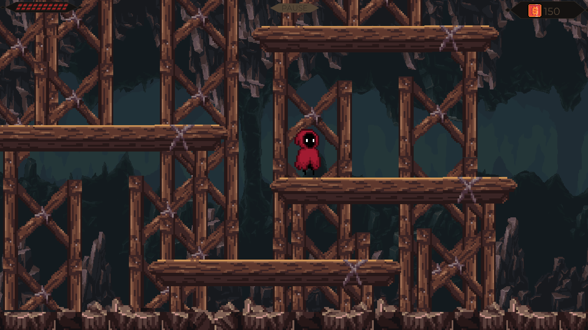
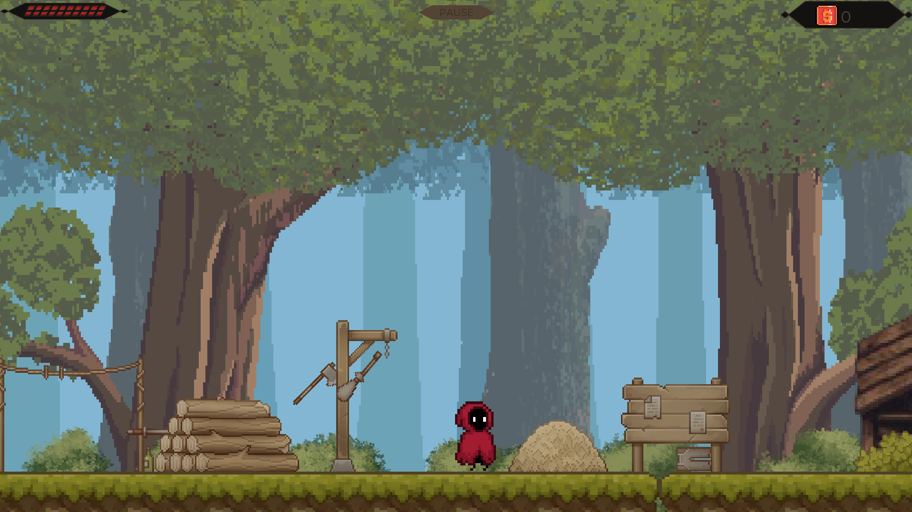
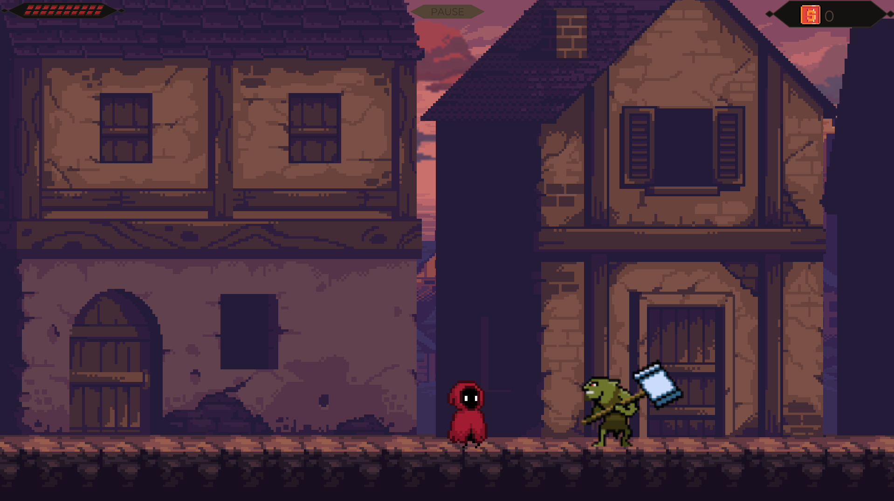
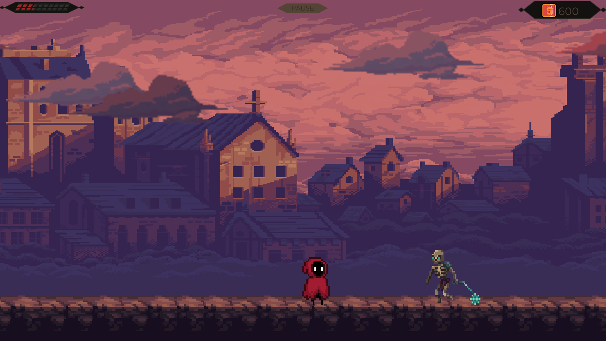
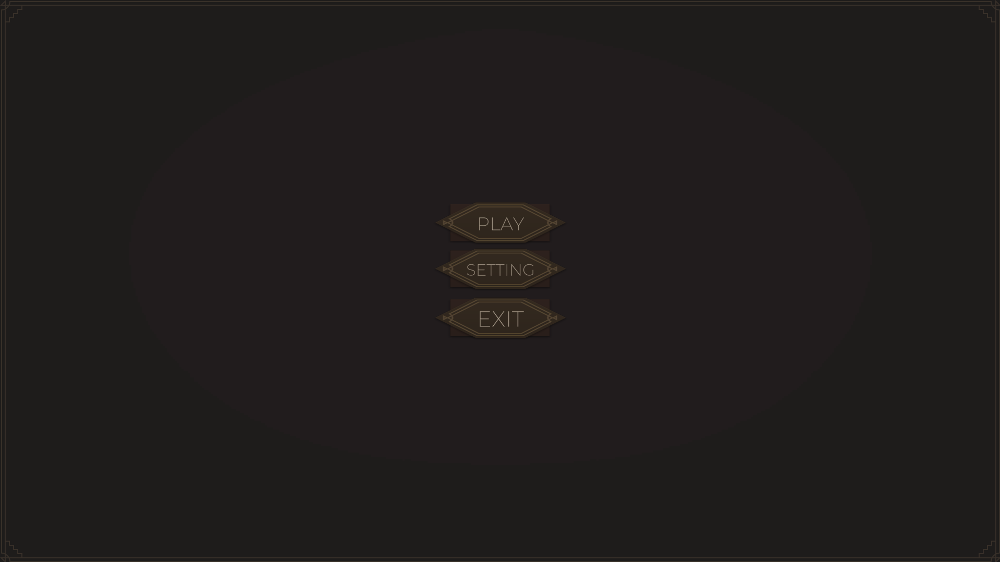
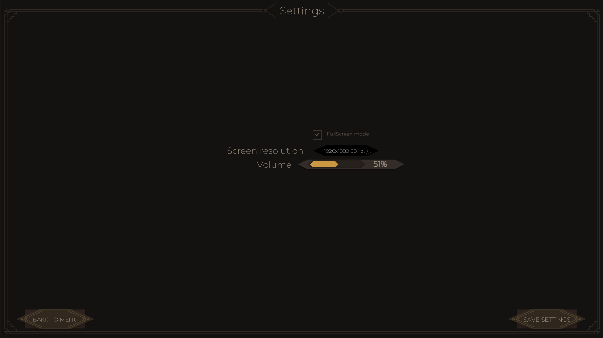

# 2D Платформер

Классический 2D-платформер с тремя уровнями, системой сбора монет и двумя типами атак. Особенность игры — каждый запуск третьего уровня создаёт уникальную комбинацию из заранее подготовленных сегментов.

## 🎮 Основные возможности

### Игровые механики
- **3 разнотипных уровня:** Первые два — линейные, третий — рандомизированный
- **Система атак:** Ближний удар + дальний огненный шар
- **Прогрессия:** Сбор монет для очков, восстановление здоровья
- **Враги:** Два типа противников ближнего боя (Скелет и Гоблин) на третьем уровне
- **Выпадение лута:** Из поверженных врагов выпадают монеты и здоровье

### Визуальные элементы
- **Parallax фон:** Многослойный фон с эффектом глубины
- **Кат-сцены:** Небольшие сюжетные вставки между уровнями
- **Плавная камера:** Реализована через **Cinemachine**

### Особенности реализации
- **Рандомизация уровня:** Третий уровень каждый раз собирается из случайного набора заранее созданных сегментов
- **Полноценный цикл игры:** От главного меню до завершения трёх уровней
- **Готовая сборка:** Проект полностью собран и готов к тестированию

## 🖼️ Галерея проекта

### Уровни
| Уровень 1: Обучение | Уровень 2: Платформинг | Уровень 3: Рандомизированный |
| :---: | :---: | :---: |
|  |  |  |
| *Знакомство с управлением* | *Платформинг с сбором монет* | *Каждый раз новая комбинация сегментов* |

### Геймплей
| Боевая система | Враги |
| :---: | :---: |
|  |    |
| *Комбинация ближней и дальней атаки* | *Два типа врагов ближнего боя* |

### Интерфейс и окружение
| Главное меню | Parallax эффект | Пример кат-сцены |
| :---: | :---: | :---: |
|    | .gif) |  |
| *Меню с базовыми настройками* | *Многослойный фон с эффектом глубины* | *Сюжетная вставка между уровнями* |

## 🔧 Техническая информация

### Основные технологии
- **Движок:** Unity **2021.3.4f1** (проект разработан на этой версии)
- **Управление камерой:** Cinemachine
- **Фон:** Parallax Scrolling
- **Генерация уровня:** Система случайного выбора и расстановки готовых сегментов
- **Язык:** C#

### Как работает рандомизация 3-го уровня
Уровень генерируется из набора заранее созданных префабов-сегментов. При каждом запуске:
1. Система случайно выбирает сегменты из доступного пула
2. Расставляет их в определённом порядке
3. Размещает врагов и предметы в соответствии с логикой сегмента

Это создаёт разнообразие прохождения при сохранении сбалансированности уровня.

## 🚀 Запуск и управление

### Для разработчиков
1. Откройте проект в Unity версии **2021.3.4f1**.
2. Основные сцены находятся в папке `My project (7)\Assets\Scenes`

### Для тестирования
1. Запустите готовую сборку из папки `Build/`
2. Управление в игре:
   - **ASD/Стрелки** — движение
   - **Пробел** — прыжок
   - **ЛКМ** — ближняя атака
   - **ПКМ** — огненный шар (уточните ваше управление)

### Особенности тестирования
- Третий уровень будет выглядеть по-разному при каждом новом запуске
- На первом и втором уровне нет врагов — они обучающие
- Враги появляются только на третьем уровне
